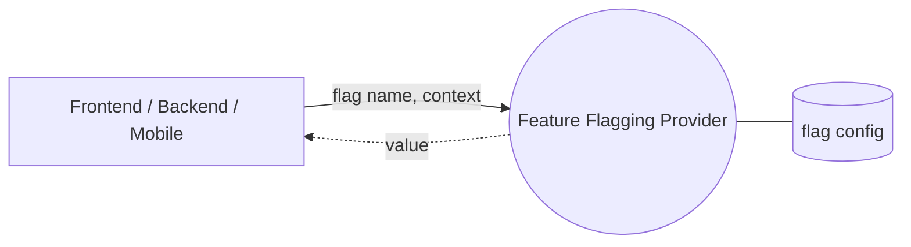

<style>
code {
  font-size: 1.5em !important;
}
.slidev-layout {
  font-size: 1.5rem !important;
}
</style>

# ⛳ OpenFeature

<hr />

<br/>

Tomáš Horáček \<<toh@ciklum.com>\>

---
layout: cover
background: ./assets/backgrounds/cover.svg
---

# Table of Contents

### ⛳ Feature Flagging
### ⛳ OpenFeature

---

# ⛳ Feature Flag

<v-clicks depth="2">

- = "feature toggle"
- ⚡ some app feature is **on/off**
- 🃏 or **variants**
  - 🆕 action button color
  - 🌡️ temperature C, F, K

</v-clicks>

---

# 🗽 Static Feature Flags

<v-click>

```ts
// staticFlags.ts

export const staticFlags = {
  // ...
  enableNewCheckout: false,
}
```

</v-click>

<v-click>

```tsx
export function TopNavigation() {
  return (
    <TopNavigationWrapper>
      <NavLink href="/">Home</NavLink>
      // ...

      {staticFlags.enableNewCheckout ? (
        <NavLink href="/new-checkout">Checkout</NavLink>
      ) : (
        <NavLink href="/checkout">Checkout</NavLink>
      )}
    </TopNavigationWrapper>
  );
}
```

</v-click>

---

# 🏗️ Build Time Feature Flags

<v-click>

```bash
# .env.dev
FEATURE_FLAG_ENABLE_NEW_CHECKOUT=true

# .env.tst
FEATURE_FLAG_ENABLE_NEW_CHECKOUT=true

# .env.stg
FEATURE_FLAG_ENABLE_NEW_CHECKOUT=false

# .env.prd
FEATURE_FLAG_ENABLE_NEW_CHECKOUT=false
```

</v-click>

<v-click>

```ts
// staticFlags.ts

export const staticFlags = {
  // ...
  enableNewCheckout:
    process.env['FEATURE_FLAG_ENABLE_NEW_CHECKOUT'] === 'true',
}
```

</v-click>

---

# 🏃 Runtime Feature Flags

<v-click>

```ts
export runtimeFlags = {
  enableNewCheckout: (currentUserEmail: string) => {
    const isProduction = process.env['ENVIRONMENT'] === 'prd';

    return !isProduction || currentUserEmail.endsWith('@acme.com');
  }
}
```

</v-click>

<v-click>

```tsx
export function TopNavigation() {
  const currentUserEmail = useCurrentUserEmail();

  return (
    <TopNavigationWrapper>      
      // ...
      {runtimeFlags.enableNewCheckout(currentUserEmail) ? (
        <NavLink href="/checkout-new">Checkout</NavLink>
      ) : (
        <NavLink href="/checkout">Checkout</NavLink>
      )}
    </TopNavigationWrapper>
  );
}
```

</v-click>

---
layout: two-cols
---

# 🏃 Runtime Feature Flags

<v-clicks>

- 📫 emails ending '@acme.com', '@abc.de', ...
- 👩‍🌾 user is gardener
- 🌖 full moon
- 📊 10% customers A/B testing

</v-clicks>

::right::

<div v-click style="text-align: center; font-size: 8rem; margin-top: 8rem;">
  🙀
</div>

---
layout: cover
---

# ⛳ Feature Flagging System

---
layout: image
image: ./assets/images/posthog2.png
---

---

# ⛳ Feature Flagging System

<div style="text-align: center; padding-top: 2rem">



</div>

---

# ⛳ Feature Flagging System

<div class="grid grid-cols-[280px_1fr] gap-4">

<v-clicks>

```ts
// Set `context`

posthog.identify(
    user.id,
    {
      email: user.email,
      name: user.name,
      hobby: user.hobby,
    },
    {}
);
```

```ts
// provide `flag name` -> get `value`

export function TopNavigation() {
  const newCheckoutEnabled = useFeatureFlagEnabled(
    'new-checkout'
  );
  
  return (
    <TopNavigationWrapper>      
      // ...
      {newCheckoutEnabled ? (
        <NavLink href="/checkout-new">Checkout</NavLink>
      ) : (
        <NavLink href="/checkout">Checkout</NavLink>
      )}
    </TopNavigationWrapper>
  );
}
```

</v-clicks>

</div>

---

# ⛳ Feature Flagging System

<v-clicks>

- 🤷 options: PostHog, Unleash, LaunchDarkly, Flagsmith, Flagship, Split, GrowthBook, Kameleoon, Taplytics, Flagship, Optimizely, ...
- 💸 cost?
- 📖 closed/open source?
- 🚢 deployment?
- 🔌 supported clients?
- 🔒 vendor lock-in

</v-clicks>

---
layout: cover
---

# ⛳ OpenFeature

---

# ⛳ OpenFeature

<v-clicks depth="2">

- open-source: https://openfeature.dev/
  - 🧾 specification
  - 🖥️ clients (.Net, Go, Java, JavaScript, PHP and counting)
  - 💁 providers (10+ and counting)
- 🤩 no vendor lock-in 
- 🥳 simple open-source providers
- 🩺 OpenTelemetry

</v-clicks>

---

# ⛳ OpenFeature

```ts
import { OpenFeature } from '@openfeature/web-sdk';
import { GoFeatureFlagProvider } from '@openfeature/go-feature-flag-provider';

export const client = OpenFeature.getClient();

await OpenFeature.setProvider(
  new GoFeatureFlagProvider({
    endpoint: 'https://...'
  })
  // new FlagdProvider() // @openfeature/flagd-provider
  // new EnvVarProvider() // @openfeature/env-var-provider
  // new FlagsmithProvider() // @openfeature/js-flagsmith-provider
  // any other provider
);
```

---

# ⛳ OpenFeature

```ts
await OpenFeature.setContext({
  targetingKey: user.id,
  email: user.email,
  name: user.name,
  hobby: user.hobby,
});
```

<v-click>

```ts
const newCheckoutEnabled = client.getBooleanValue(
  'new-checkout', false
);
```

</v-click>

---

# ⛳ OpenFeature - flagd / go-feature-flag

<v-clicks>

- simple server
- file-based configuration (JSON, YAML, ...)
  - local, blob storage, kubernetes configmap, HTTPS, ...

```yaml
new-checkout:
  variations:
    A: false
    B: true
  targeting:
    - query: (email ew "@acme.com") or (hobby co "gardener")
      variation: B
  defaultRule:
    variation: A
```

</v-clicks>

---

# go-feature-flag - A/B experiment

```yaml
experimentation-flag:
  variations:
    variationA: A
    variationB: B
  defaultRule:
    percentage:
      variationA: 50
      variationB: 50
  experimentation:
    start: 2023-06-20T00:00:00.1-05:00
    end: 2023-06-27T00:00:00.1-05:00
```

---

# go-feature-flag - progressive rollout

```yaml
progressive-flag:
  variations:
    variationA: A
    variationB: B
  defaultRule:
    progressiveRollout:
      initial:
        variation: variationB
        percentage: 0
        date: 2023-11-20T00:00:00.1-05:00
      end:
        variation: variationB
        percentage: 100
        date: 2023-12-20T00:00:00.1-05:00
```

---
layout: cover
background: ./assets/backgrounds/cover.svg
---

# 🙋 QA

---
layout: cover
background: ./assets/backgrounds/cover.svg
---

# Thank You!
